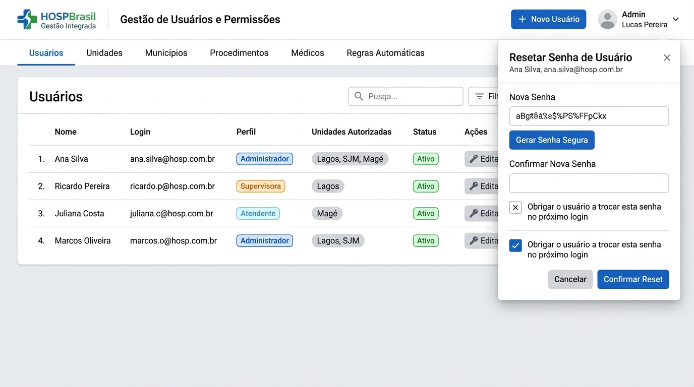
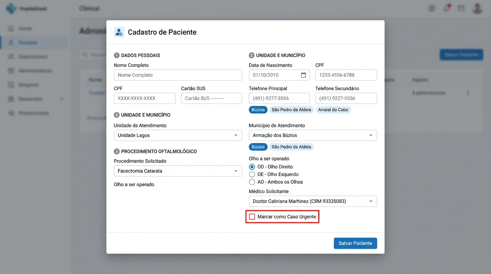
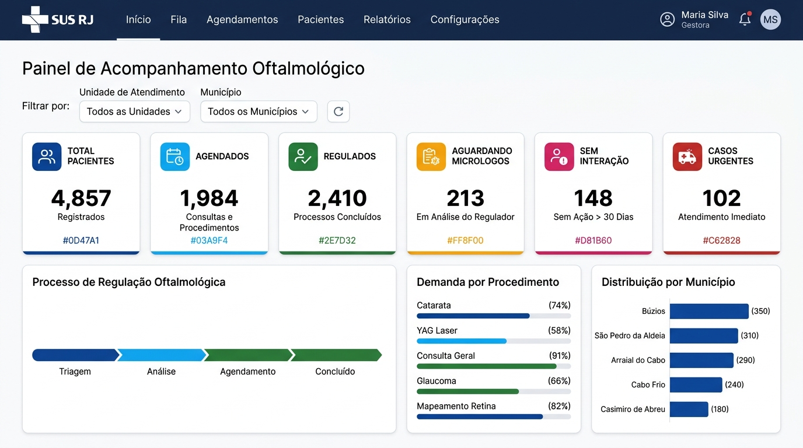

# ⚙️ Manual Ilustrado de Governança — Perfil Administrador
**Sistema de Regulação e Controle de Pacientes Oftalmológicos (SUS - RJ)**

---

## 🎯 Objetivo
Este guia foi feito para o **Administrador do Sistema**. Ele explica, de forma simples e ilustrada, como gerenciar usuários, cadastrar polos e municípios, resetar senhas e calibrar as regras automáticas do sistema.

---

## 👥 1. Gestão de Usuários e Senhas

Na aba **Administração** -> sub-aba **Usuários**:

### 1.1. Como Cadastrar um Novo Usuário
1. Clique no botão azul **+ Novo Usuário**.
2. Preencha:
   - **Nome Completo**: Nome do profissional.
   - **Login de Acesso**: Identificador institucional único (ex: `herika.quaresma` ou `marina.costa`).
   - **E-mail**: Preenchido automaticamente com `@gestao.saude.rj.gov.br`.
   - **Senha Provisória**: Digite uma senha temporária inicial.
   - **Perfil (Role)**: Escolha `Atendente`, `Supervisora` ou `Administrador`.
   - **Unidades Autorizadas**: Marque quais polos o usuário pode ver (ex: marcar apenas *Unidade Lagos* para funcionários daquela unidade).
   - ✅ **Obrigar troca de senha no próximo login**: **Deixe sempre marcado!** Assim, no primeiro acesso, o sistema força o usuário a criar sua senha pessoal própria.
3. Clique em **Salvar Usuário**. A conta é criada na hora no banco de dados **Supabase Auth**.

### 1.2. Como Resetar a Senha de um Usuário
Se um atendente ou supervisora esquecer a senha:
1. Na lista de usuários, clique no botão **Resetar Senha** (ícone de chave).
2. Clique no botão **Gerar Senha Segura** (o sistema cria uma senha forte aleatória, ex: `#EWrkebu`).
3. Marque a caixinha **Obrigar o usuário a trocar esta senha no próximo login**.
4. Clique em **Confirmar Reset**.
5. Copie a senha e passe para o usuário. Ao logar, o sistema pedirá que ele digite uma nova senha definitiva.

### 1.3. Desativando um Acesso
Se um colaborador sair da equipe ou for transferido:
- Clique em **Editar** no usuário e desmarque a opção **Usuário Ativo**.
- O login dele é bloqueado imediatamente, mantendo todo o histórico de ações salvo para auditoria.

---

## 🏥 2. Gestão de Unidades de Saúde e Municípios

Na sub-aba **Unidades**:

### Como configurar os Polos e Municípios Atendidos:
1. Cada unidade representa um polo físico (ex: **Unidade Lagos**, **São João de Meriti**, **Magé**).
2. Ao editar ou criar a unidade, você define o campo **Municípios Atendidos**:
   - Para a **Unidade Lagos**: Selecione `Armação dos Búzios`, `São Pedro da Aldeia` e `Arraial do Cabo`.
   - Para **São João de Meriti**: Selecione `São João de Meriti`.
   - Para **Magé**: Selecione `Magé`.
3. Essa configuração garante que, quando o atendente estiver registrando um paciente ou tirando relatórios, **apenas os municípios daquela unidade fiquem disponíveis**.

---

## ⚡ 3. Parametrização das Regras Automáticas

Na sub-aba **Regras e Parâmetros**, você ajusta como o sistema automatiza a regulação:

| Regra Automática | Padrão Recomendado | O que acontece quando atingido? |
| :--- | :---: | :--- |
| **Limite de Faltas** | **2 faltas** | O paciente é transferido sozinho para **Aguardando Micrologos** para que a supervisão avalie o caso. |
| **Tentativas de Contato sem Êxito** | **3 tentativas** | O paciente é transferido sozinho para **Aguardando Micrologos** para acionamento do agente comunitário de saúde. |
| **Intervalo de Retorno Cirúrgico** | **7 a 15 dias** | Alerta no prontuário para agendamento do exame de pós-operatório. |

---

## 📊 4. Visão Executiva Geral (Dashboard)

Como administrador, você tem acesso irrestrito a todas as unidades e a todos os indicadores em tempo real:

- Alterne entre os polos no seletor de topo para acompanhar o desempenho de cada equipe.
- Verifique a distribuição da demanda cirúrgica e garanta que não haja pacientes acumulados sem contato (*Sem Interação*).

---

## ☁️ 5. Status do Banco de Dados Supabase
Na barra superior azul-marinho:
- **Ponto Verde (Supabase Conectado)**: Todas as gravações estão sendo enviadas com sucesso para a nuvem.
- **Sincronização Manual**: Ao clicar no ícone de banco de dados, você pode forçar o envio imediato (*Enviar Dados Locais para o Supabase*) ou recarregar os dados mais recentes (*Recarregar Dados da Nuvem*).
