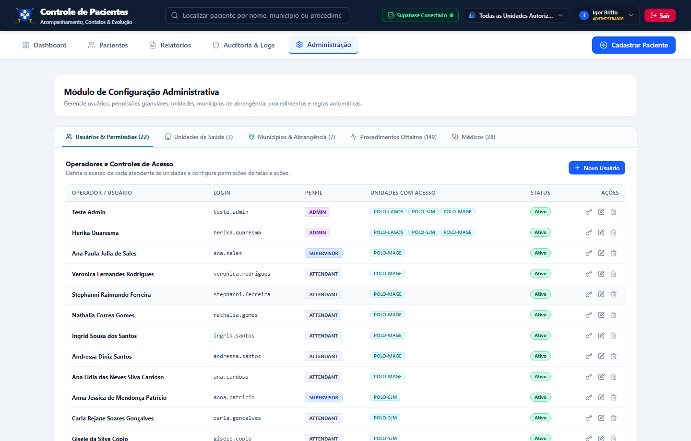

# ⚙️ Manual Ilustrado de Governança — Perfil Administrador
**Sistema de Regulação e Controle de Pacientes Oftalmológicos (SUS - RJ)**

---

## 🎯 Objetivo
Este guia foi preparado para o **Administrador do Sistema**. Ele explica, de forma simples e com imagens reais do sistema em execução, como gerenciar usuários, cadastrar polos e municípios de abrangência, resetar senhas e calibrar as regras automáticas de regulação.

---

## 🔑 1. Acesso e Autenticação

1. Acesse o sistema pelo navegador.
2. Informe suas credenciais de Administrador institucional.
3. Clique em **Acessar o Sistema**.

---

## 👥 2. Gestão de Usuários, Acessos e Senhas

Na aba **Administração** -> sub-aba **Usuários & Permissões**:

### 2.1. Como Cadastrar um Novo Usuário
1. Clique no botão azul **+ Novo Usuário**.
2. Preencha as informações:
   - **Nome Completo**: Nome da atendente ou supervisora.
   - **Login de Acesso**: Identificador único do operador (ex: `herika.quaresma`, `ana.sales`).
   - **E-mail**: Preenchido automaticamente com domínio `@gestao.saude.rj.gov.br`.
   - **Senha Provisória**: Digite a senha inicial de acesso.
   - **Perfil (Role)**: Escolha `Atendente`, `Supervisora` ou `Administrador`.
   - **Unidades Autorizadas**: Selecione quais polos o usuário terá acesso (ex: `POLO-LAGOS`, `POLO-SJM`, `POLO-MAGE`).
   - ✅ **Obrigar troca de senha no próximo login**: Deixe sempre ativado para novos operadores, garantindo sigilo individual.
3. Clique em **Salvar Usuário**. O registro é integrado imediatamente com o serviço de autenticação do **Supabase Auth**.

### 2.2. Como Resetar a Senha de um Colaborador
Caso um usuário esqueça sua senha:
1. Localize o usuário na tabela de operadores.
2. Clique no ícone de chave (**Resetar Senha**).
3. Utilize a função de **Gerar Senha Segura** para criar uma credencial temporária forte.
4. Mantenha marcada a opção **Obrigar o usuário a trocar esta senha no próximo login**.
5. Clique em **Confirmar Reset** e repasse a senha temporária ao colaborador de forma reservada.

### 2.3. Desativação de Usuários
- Se um operador for desligado da operação ou transferido, basta editar o registro e desmarcar **Ativo**. O acesso é revogado na hora, sem apagar o histórico de auditoria das ações que ele realizou.

---

## 🏥 3. Unidades de Saúde e Abrangência Municipal

Na sub-aba **Unidades de Saúde** e na tela de cadastro:

### Como funciona a restrição de municípios:
1. Cada unidade de saúde possui uma lista oficial de municípios conveniados:
   - **Unidade Lagos**: `Armação dos Búzios`, `São Pedro da Aldeia` e `Arraial do Cabo`.
   - **Unidade São João de Meriti**: `São João de Meriti`.
   - **Unidade Magé**: `Magé`.
2. Essa parametrização garante que, no momento em que a atendente abre o formulário de cadastro ou na emissão de relatórios, o campo **Município de Atendimento** traga unicamente as cidades autorizadas para aquele polo.

---

## ⚡ 4. Parametrização das Regras Automáticas de Regulação

O sistema opera com regras automáticas configuráveis para evitar pacientes represados na fila:

| Regra Automática | Parâmetro Recomendado | Ação do Sistema |
| :--- | :---: | :--- |
| **Limite de Faltas** | **2 faltas** | O paciente é transferido automaticamente para **Aguardando Micrologos** para que a supervisão e o município reavaliem a situação. |
| **Tentativas de Contato sem Êxito** | **3 tentativas** | O paciente é movido para **Aguardando Micrologos** para busca ativa na atenção primária (UBS). |
| **Tempo Limite de Sessão** | **15 minutos** | Logout preventivo automático por inatividade para conformidade com a LGPD e privacidade de dados médicos. |

---

## 📊 5. Painel Executivo Geral (Dashboard)

O administrador possui visão abrangente e consolidada de todas as unidades:

- Acompanhe a distribuição em tempo real entre os status **Regulados**, **Agendados**, **Micrologos**, **Sem Interação** e **Casos Urgentes**.
- Filtre por polo individual ou visualize o agregado estadual no seletor de unidades do cabeçalho.

---

## 📈 6. Central de Relatórios e Exportações

Na aba **Relatórios**, o administrador pode auditar todo o histórico e exportar dados brutos:

- Filtros combinados por Unidade, Município, Procedimento, Prioridade e Intervalo de Datas.
- Exportação nativa em formato Excel (`.xlsx`) e visualização/impressão direta em documento PDF com cabeçalho do SUS.
