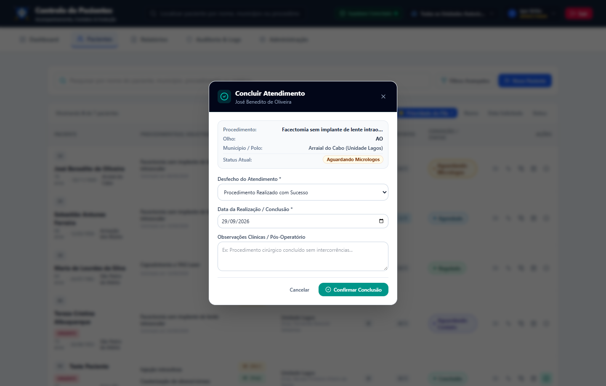

# 📖 Manual Ilustrado de Utilização — Perfil Atendente
**Sistema de Regulação e Controle de Pacientes Oftalmológicos (SUS - RJ)**

---

## 🎯 Objetivo
Este guia foi feito para você, **Atendente**. Ele ensina, passo a passo e com imagens reais do sistema, como realizar os cadastros, localizar pacientes, registrar contatos telefônicos e atualizar a situação de cada paciente.

---

## 🔑 1. Acesso e Primeiro Login

1. Abra o navegador e acesse o endereço do sistema.
2. Digite seu **Operador / Usuário** e sua **Senha**.
3. Clique no botão azul **Acessar o Sistema**.

> 💡 **Importante — Troca Obrigatória de Senha**:
> Se for o seu primeiro acesso ou se sua senha foi resetada pela coordenação, o sistema solicitará que você cadastre uma nova senha pessoal antes de prosseguir. Guarde sua senha com segurança.

> ⏱️ **Segurança Automática**:
> Se você ficar **15 minutos** sem mexer no sistema, ele sairá automaticamente para proteger os dados clínicos dos pacientes. Basta digitar sua senha novamente para continuar.

---

## 🏥 2. Selecionando sua Unidade de Atendimento

No topo da tela, na barra superior escura:
- Clique no seletor com o ícone de prédio (**Unidade de Atendimento**).
- Escolha a sua unidade (ex: **Unidade Lagos**, **São João de Meriti** ou **Magé**).
- O sistema filtrará imediatamente os dados e pacientes da sua região.

---

## 📊 3. Entendendo o Painel Principal (Dashboard)

Ao entrar no sistema, você verá o painel com **6 cartões coloridos** e os gráficos de acompanhamento:

### O que significa cada cartão:
| Cartão | Cor | O que indica? | O que você deve fazer? |
| :--- | :---: | :--- | :--- |
| **TOTAL** | 🔵 Azul | Total de pacientes no recorte selecionado. | Visão geral da fila regulada. |
| **AGENDADOS** | 🔷 Ciano | Pacientes que já têm data de cirurgia/exame confirmada. | Acompanhar confirmações de comparecimento. |
| **REGULADOS** | 🟢 Verde | Pacientes autorizados pela regulação médica. | Prioridade para agendamento. |
| **MICROLOGOS** | 🟡 Amarelo | Pacientes com **2 faltas** ou **3 ligações sem sucesso**. | Aguardam ação com a coordenação/posto de saúde. |
| **SEM INTERAÇÃO** | 🔴 Rosa | Pacientes novos que **nunca receberam nenhuma ligação**. | **Sua prioridade diária de contato ativo!** |
| **CASOS URGENTES** | 🚨 Vermelho | Pacientes com solicitação médica de urgência prioritária. | Prioridade máxima no fluxo. |

> 👆 **Dica**: Você pode navegar para a aba **Pacientes** para ver a lista completa e aplicar filtros adicionais.

---

## 📝 4. Como Cadastrar um Novo Paciente

Para cadastrar um paciente com encaminhamento ambulatorial:
1. Acesse a aba **Pacientes** no menu superior e clique no botão azul **+ Novo Paciente**.
2. A janela de cadastro oficial será aberta:

### Preencha os campos organizados:

#### 🔹 1. Unidade e Município de Atendimento
- **Unidade Responsável**: Selecione a sua unidade (ex: `Unidade Lagos (São Pedro da Aldeia)`).
- **Município de Atendimento**:
  - O sistema lista **apenas os municípios atendidos pela sua unidade**.
  - *Exemplo*: Na Unidade Lagos, aparecem exclusivamente: `Armação dos Búzios`, `São Pedro da Aldeia` e `Arraial do Cabo`.

#### 🔹 2. Dados do Paciente
- **Nome Completo do Paciente**: Digite o nome completo sem abreviações.
- **Data de Nascimento**: O sistema calcula a idade automaticamente.

#### 🔹 3. Procedimento e Dados Clínicos
- **Procedimento Oftalmológico**: Selecione o procedimento solicitado (ex: `Facectomia sem implante de lente intraocular` ou `Capsulotomia a YAG Laser`).
- **Olho Solicitado**: Selecione `OD` (Direito), `OE` (Esquerdo) ou `AO` (Ambos).
- **Data Solicitada / Encaminhamento**: Informe a data indicada no pedido do médico.
- **Médico Solicitante**: Selecione o oftalmologista que emitiu o laudo.
- **Condição / Status Inicial**: Padrão `Aguardando Contato`.
- **Classificar como URGENTE**: Marque a caixinha caso haja indicação médica expressa de urgência.
- Clique em **Cadastrar Paciente** para salvar.

---

## 📞 5. Rotina Diária: Registro de Tentativas de Contato

Na aba **Pacientes**, localize o paciente e clique no botão de **Contato** (ícone de telefone):

### Passo a passo para registrar a ligação:
1. O sistema mostra o número da tentativa (ex: *1ª Tentativa*, *2ª Tentativa* ou *3ª Tentativa*).
2. Confira a **Data da Ligação/Contato** e o **Horário**.
3. Selecione o **Canal de Comunicação**:
   - `Ligação Telefônica`
   - `WhatsApp`
   - `Recado Familiar`
   - `Agente Comunitário`
   - `Outro Meio`
4. Selecione o **Resultado da Tentativa**:
   - `Contato com Sucesso - Agendamento Confirmado`
   - `Contato com Sucesso - Paciente Recusou / Desistiu`
   - `Contato com Sucesso - Paciente Informou Doença`
   - `Sem Resposta / Chamou até cair`
   - `Número Ocupado`
   - `Caixa Postal`
   - `Número Inexistente / Errado`
   - `Recado Deixado com Terceiro`
5. Escreva nas **Observações / Detalhes** as informações relevantes.
6. Clique no botão verde **Salvar Tentativa**.

> ⚠️ **Atenção — Regra Automática**:
> Ao atingir **3 tentativas sem sucesso seguidas**, o sistema move o paciente automaticamente para o status **Aguardando Micrologos** para que a supervisão tome providências junto ao município de origem.

---

## ❌ 6. Como Registrar Faltas e Justificativas

Se o paciente faltar a uma consulta agendada ou ao procedimento cirúrgico:
1. Na lista de pacientes, acione o registro de falta (ícone de calendário com X).
2. Indique se houve apresentação de atestado ou justificativa plausível.
3. Descreva o motivo no campo de texto.
4. Salve o registro.

> ⚠️ **Regra das 2 Faltas**:
> Com **2 faltas registradas**, o paciente vai automaticamente para **Aguardando Micrologos**.

---

## ✅ 7. Como Concluir o Atendimento de um Paciente

Após o paciente realizar o exame ou cirurgia:
1. Na lista de pacientes, na coluna **Ações**, clique no botão com ícone de check (**Marcar como Concluído**).
2. A janela **Concluir Atendimento** será aberta:

3. Selecione o **Desfecho do Atendimento** (ex: *Procedimento Realizado com Sucesso*, *Alta Médica / Tratamento Concluído* ou *Cirurgia Concluída - Pós-Operatório Agendado*).
4. Informe a **Data da Realização** e anote observações relevantes da recuperação do paciente.
5. Clique em **Confirmar Conclusão**. O paciente receberá a etiqueta verde **Concluído** no prontuário.

---

## 📜 8. Prontuário e Linha do Tempo

- Ao clicar no nome do paciente (ou em qualquer linha da tabela), você visualiza a **Linha do Tempo** auditada de todas as ações: data do cadastro, ligações realizadas, desfechos de atendimento e nomes dos operadores responsáveis.
