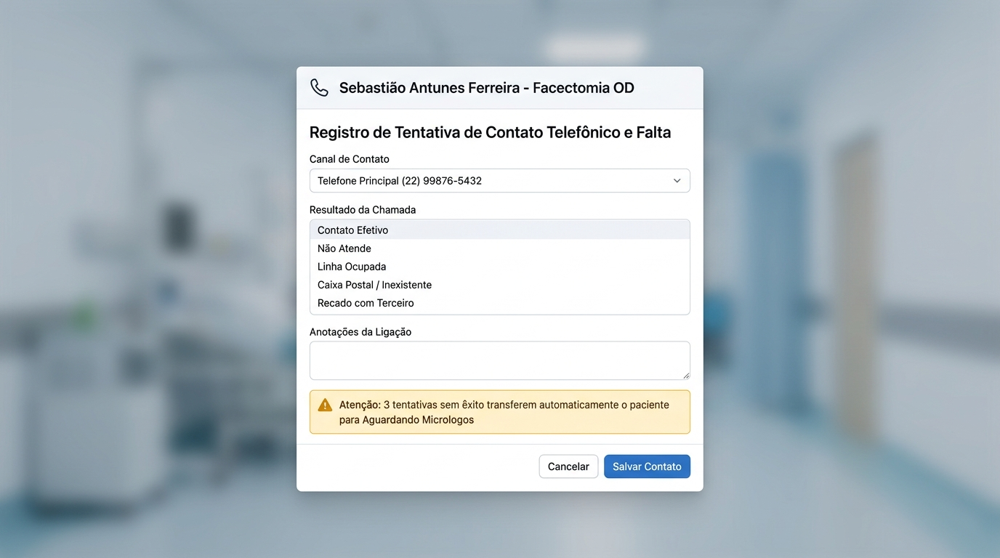

# 📖 Manual Ilustrado de Utilização — Perfil Atendente
**Sistema de Regulação e Controle de Pacientes Oftalmológicos (SUS - RJ)**

---

## 🎯 Objetivo
Este guia foi feito para você, **Atendente**. Ele ensina, passo a passo e com imagens, como realizar os cadastros, localizar pacientes, registrar contatos telefônicos e atualizar a situação de cada paciente.

---

## 🔑 1. Acesso e Primeiro Login

1. Abra o navegador e digite o endereço do sistema.
2. Digite seu **Usuário** e sua **Senha provisória** fornecida pela coordenação.
3. Clique no botão azul **Acessar o Sistema**.

> 💡 **Importante — Troca Obrigatória de Senha**:
> Se for o seu primeiro acesso, uma janela solicitará que você crie sua nova senha pessoal. Escolha uma senha segura de no mínimo 4 dígitos e guarde-a com você.

> ⏱️ **Segurança Automática**:
> Se você ficar **15 minutos** sem mexer no sistema, ele sairá automaticamente para proteger os dados dos pacientes. Basta digitar sua senha novamente para continuar.

---

## 🏥 2. Selecionando sua Unidade de Atendimento

No topo da tela, na barra azul escura:
- Clique no seletor com o ícone de prédio (**Unidade de Atendimento**).
- Escolha a sua unidade (ex: **Unidade Lagos**, **São João de Meriti** ou **Magé**).
- O sistema filtrará imediatamente os pacientes da sua região.

---

## 📊 3. Entendendo o Painel Principal (Dashboard)

Ao entrar no sistema, você verá o painel com **6 cartões coloridos**:

### O que significa cada cartão:
| Cartão | Cor | O que indica? | O que você deve fazer? |
| :--- | :---: | :--- | :--- |
| **Total Pacientes** | 🔵 Azul | Total de pacientes cadastrados na unidade. | Visão geral da fila. |
| **Agendados** | 🔷 Ciano | Pacientes que já têm data de cirurgia/exame marcada. | Acompanhar confirmações. |
| **Regulados** | 🟢 Verde | Pacientes autorizados pela regulação médica. | Prontos para agendamento. |
| **Aguardando Micrologos** | 🟡 Amarelo | Pacientes que **faltaram 2 vezes** ou tiveram **3 ligações sem sucesso**. | Aguardam ação da supervisão/posto de saúde. |
| **Sem Interação** | 🔴 Rosa | Pacientes novos que **nunca receberam nenhuma ligação**. | **Sua prioridade diária de contato!** |
| **Casos Urgentes** | 🚨 Vermelho | Pacientes com urgência médica imediata. | Prioridade máxima de agendamento. |

> 👆 **Dica de Ouro**: Você pode **clicar em cima de qualquer cartão** e o sistema abrirá a lista filtrada apenas com aqueles pacientes!

---

## 📝 4. Como Cadastrar um Novo Paciente

Para cadastrar um paciente que chegou com encaminhamento:
1. No menu superior, clique no botão azul **+ Novo Paciente**.
2. A janela de cadastro será aberta:

### Preencha em 3 etapas simples:

#### 🔹 Etapa 1: Dados Pessoais
- **Nome Completo**: Digite o nome completo sem abreviações.
- **Data de Nascimento**: O sistema calcula a idade na hora.
- **CPF** e **Cartão SUS**: Digite os números dos documentos.
- **Telefone Principal**: DDD + Número com WhatsApp (ex: `(22) 99876-5432`). **Confirme se o número está correto!**
- **Telefone Secundário / Recado**: Telefone de um parente ou vizinho.

#### 🔹 Etapa 2: Unidade e Município de Atendimento
- **Unidade de Atendimento**: Selecione a sua unidade (ex: `Unidade Lagos`).
- **Município de Atendimento**:
  - O sistema mostra **apenas os municípios atendidos pela sua unidade**.
  - *Exemplo*: Na Unidade Lagos só aparecerão: `Armação dos Búzios`, `São Pedro da Aldeia` e `Arraial do Cabo`.

#### 🔹 Etapa 3: Dados Clínicos do Olho
- **Procedimento Solicitado**: Escolha o procedimento (ex: `Facectomia com Implante de LIO (Catarata)`).
- **Olho a ser operado**:
  - `OD` = Olho Direito
  - `OE` = Olho Esquerdo
  - `AO` = Ambos os Olhos
- **Médico Solicitante**: Escolha o oftalmologista do pedido (o CRM aparece sozinho).
- **Marcar como Caso Urgente**: Marque a caixinha vermelha apenas se o pedido médico tiver carimbo de urgência.
- Clique em **Salvar Paciente**. Pronto! O paciente já está na fila oficial.

---

## 📞 5. Rotina Diária: Como Registrar Ligações e Contatos

Na aba **Pacientes**, localize o paciente pelo nome ou CPF e clique no botão **Contato** (ícone de telefone):

### Passo a passo para registrar a ligação:
1. Escolha o **Canal de Contato**: Telefone Principal, WhatsApp ou Recado.
2. Selecione o **Resultado da Chamada**:
   - `Contato Efetivo`: O paciente atendeu e confirmou as informações.
   - `Não Atende`: Tocou até cair.
   - `Linha Ocupada`: Telefone deu sinal de ocupado.
   - `Caixa Postal / Inexistente`: Número desligado ou inexistente.
   - `Recado com Terceiro`: Falou com familiar ou vizinho.
3. Escreva nas **Anotações da Ligação** um resumo rápido (ex: *"Paciente confirmou que comparecerá dia 15 acompanhado da filha"*).
4. Clique em **Salvar Contato**.

> ⚠️ **Atenção — Regra Automática**:
> Se você registrar **3 ligações sem sucesso seguidas** para o mesmo paciente, o sistema moverá ele sozinho para **Aguardando Micrologos** e avisará a supervisora para acionar o posto de saúde!

---

## ❌ 6. Como Registrar uma Falta

Se o paciente não compareceu à consulta ou ao procedimento:
1. Na lista de pacientes, clique em **Registrar Falta**.
2. Informe a **Data da Falta** e se o paciente justificou (ex: apresentou atestado médico).
3. Escreva o motivo e clique em **Confirmar**.

> ⚠️ **Atenção — Regra das 2 Faltas**:
> Se o paciente tiver **2 faltas**, o sistema automaticamente mudará o status para **Aguardando Micrologos**.

---

## 🩺 7. Como Registrar uma Evolução / Mudar o Status

Quando o paciente trouxer exames, passar por avaliação ou mudar de condição:
1. Clique no botão **Evolução** na linha do paciente.
2. Selecione a situação (ex: *Exames Pré-operatórios OK*, *Aguardando Risco Cirúrgico*, *Desistência*).
3. Se o status geral mudou, selecione o novo (ex: de *Aguardando Contato* para *Agendado*).
4. Digite a anotação e clique em **Salvar Evolução**.

---

## 📜 8. Como Consultar o Histórico (Prontuário)
- Basta clicar em cima do **Nome do Paciente** em qualquer tabela.
- Você verá a ficha cadastral completa e a **Linha do Tempo**, com o dia e hora exatos de todas as ligações, cadastros e anotações feitas para aquele paciente.
