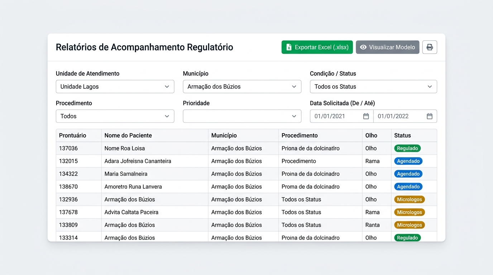

# 📊 Manual Ilustrado de Gestão — Perfil Supervisora
**Sistema de Regulação e Controle de Pacientes Oftalmológicos (SUS - RJ)**

---

## 🎯 Objetivo
Este guia foi preparado para a **Supervisora / Coordenação Clínica**. Ele demonstra de forma clara, visual e simples como monitorar a fila de espera, definir prioridades, gerenciar casos retidos e emitir relatórios oficiais em Excel e PDF.

---

## 🖥️ 1. O Painel de Controle (Dashboard)

Ao entrar no sistema, você tem a visão gerencial completa dos seus polos de atendimento:

### 🔹 Como usar os filtros do topo:
1. **Unidade de Atendimento**: Alterne entre *Unidade Lagos*, *São João de Meriti*, *Magé* ou veja *Todas as Unidades*.
2. **Município**: O seletor adapta-se sozinho à unidade escolhida (ex: na Unidade Lagos, filtra entre *Armação dos Búzios*, *São Pedro da Aldeia* e *Arraial do Cabo*).

### 🔹 Indicadores Rápidos:
- **Total Pacientes**: Carga geral de atendimento.
- **Agendados**: Pacientes com cirurgias já marcadas.
- **Regulados**: Pacientes autorizados pela auditoria médica.
- **Aguardando Micrologos**: 🚨 **Atenção Prioritária** — Pacientes com 2 faltas ou 3 contatos sem sucesso.
- **Sem Interação**: Fila nova aguardando a primeira ligação da equipe de atendimento.
- **Casos Urgentes**: Pacientes com risco visual iminente.

### 🔹 Gráficos Inteligentes:
- **Demanda por Procedimento**: Mostra as cirurgias mais pedidas (Catarata, YAG Laser, etc.).
- **Distribuição por Município**: Permite clicar diretamente no nome de uma cidade para filtrar os números apenas para ela.

---

## 📋 2. Como Gerenciar e Priorizar a Fila de Pacientes

Na aba **Pacientes**, a supervisora coordena a fila cirúrgica:

### 2.1. Concedendo Prioridade Manual (*Priority Override*)
Quando um paciente tiver determinação judicial ou laudo médico de urgência:
1. Localize o paciente na lista.
2. Clique no ícone de **Prioridade** (estrela/escudo).
3. Ative **Prioridade Manual**.
4. Defina a posição prioritária e **escreva a justificativa clínica** (ex: *"Perda súbita de visão no olho único - laudo anexo"*).
5. Clique em **Confirmar**. O paciente sobe para o topo da fila regulada.

### 2.2. Edição de Dados Após o Cadastro
Diferente dos atendentes, a supervisora pode:
- Corrigir o **olho a ser operado** (`OD`, `OE`, `AO`).
- Mudar o **procedimento solicitado** ou médico solicitante.
- Retificar datas e dados cadastrais.

---

## ⚠️ 3. O que Fazer com Pacientes em "Aguardando Micrologos"?

O sistema move automaticamente para **Aguardando Micrologos** quando:
- O paciente teve **3 ligações sem sucesso** registradas pela recepção.
- O paciente teve **2 faltas** em agendamentos.

### Ação da Supervisão:
1. Clique no card **Aguardando Micrologos** no Dashboard.
2. Abra o histórico do paciente para checar os telefones e datas das tentativas.
3. Se for caso de telefone desatualizado, faça contato institucional com a **Unidade Básica de Saúde (UBS)** do município do paciente para busca ativa no bairro.
4. Quando o paciente for localizado, registre uma **Evolução** e recoloque o paciente como **Agendado** ou **Aguardando Contato**.

---

## 📈 4. Como Emitir e Exportar Relatórios Oficiais

Na aba **Relatórios**, você gera demonstrativos oficiais para a Secretaria de Saúde:

### 🔹 Passo 1: Escolha os Filtros
- **Unidade de Atendimento**: Escolha o polo desejado.
- **Município**: Só aparecem as cidades atendidas por aquela unidade.
- **Condição / Status**: Escolha um status específico ou deixe *Todos os Status*.
- **Procedimento**: Filtre por cirurgia (ex: *Catarata*).
- **Prioridade**: Normais ou Apenas Urgentes.
- **Data Solicitada (De / Até)**: Período do relatório.

### 🔹 Passo 2: Exportar ou Imprimir
- **Exportar Excel (.xlsx)** (Botão Verde): Baixa imediatamente uma planilha pronta com todas as colunas organizadas para prestação de contas.
- **Visualizar Modelo / Imprimir**: Gera a versão em PDF diagramada com cabeçalho oficial do SUS para assinatura e arquivamento.

---

## 🛡️ 5. Trilha de Auditoria Clínica

Na aba **Auditoria**:
- Acompanhe a lista de todas as ações feitas no sistema: quem cadastrou, quem ligou, quem alterou a prioridade e quando o sistema aplicou regras automáticas.
- Isso assegura total transparência e conformidade com o SUS e órgãos fiscalizadores.
