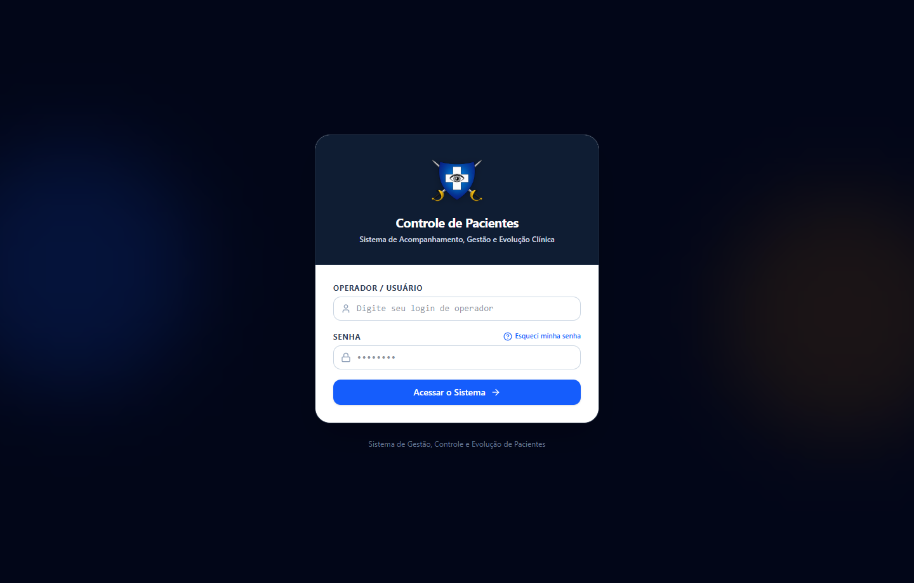
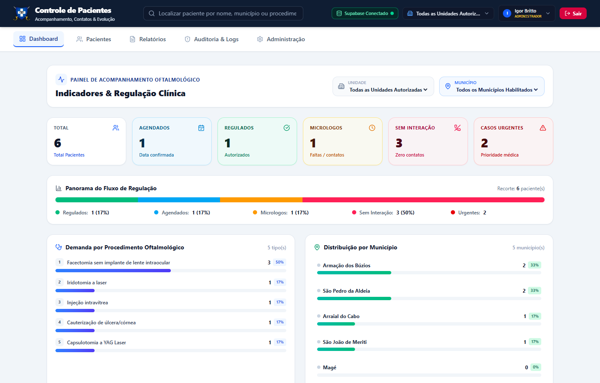
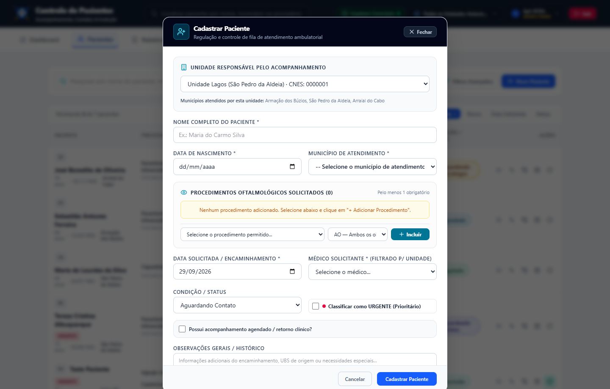
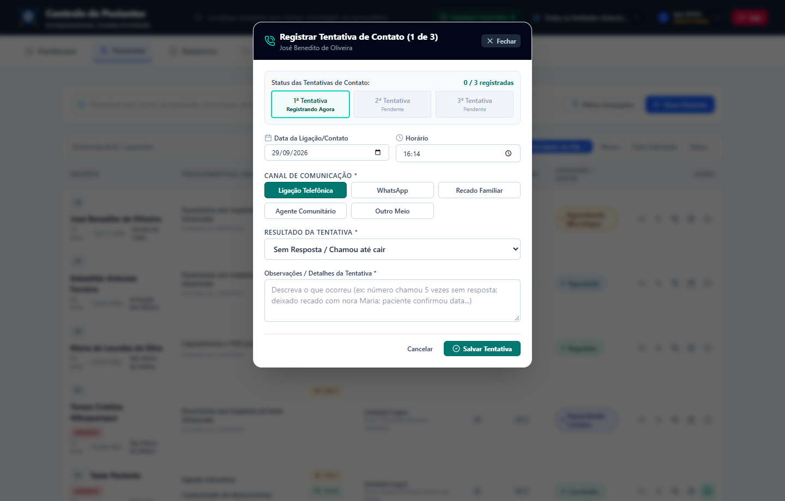
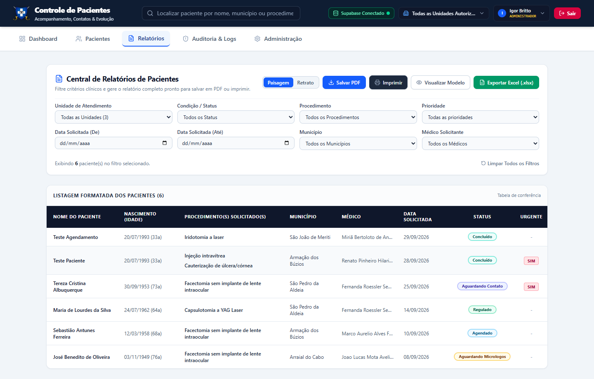

# 📊 Manual Ilustrado de Gestão — Perfil Supervisora
**Sistema de Regulação e Controle de Pacientes Oftalmológicos (SUS - RJ)**

---

## 🎯 Objetivo
Este guia foi preparado para a **Supervisora / Coordenação Clínica**. Ele demonstra de forma clara, visual e simples como monitorar a fila de espera, definir prioridades, gerenciar casos retidos e emitir relatórios oficiais em Excel e PDF com imagens reais do sistema.

---

## 🔑 1. Acesso ao Sistema

1. Acesse o sistema pelo navegador.
2. Informe seu usuário de supervisão e sua senha.
3. Clique em **Acessar o Sistema**.

---

## 🖥️ 2. O Painel de Acompanhamento (Dashboard)

Ao entrar no sistema, você visualiza os indicadores executivos em tempo real:

### 🔹 Como usar os filtros do topo:
1. **UNIDADE**: Alterne entre *Unidade Lagos*, *São João de Meriti*, *Magé* ou visualize *Todas as Unidades Autorizadas*.
2. **MUNICÍPIO**: O filtro adapta-se estritamente à unidade escolhida (ex: ao selecionar a Unidade Lagos, lista apenas *Armação dos Búzios*, *São Pedro da Aldeia* e *Arraial do Cabo*).

### 🔹 Indicadores Clínicos & Regulação:
- **TOTAL**: Total de pacientes regulados no recorte.
- **AGENDADOS**: Pacientes com agendamento confirmado.
- **REGULADOS**: Pacientes autorizados aguardando agendamento.
- **MICROLOGOS**: 🚨 **Atenção Prioritária** — Pacientes retidos por 2 faltas consecutivas ou 3 tentativas de contato frustradas.
- **SEM INTERAÇÃO**: Pacientes recém-cadastrados aguardando a 1ª ligação da equipe de atendimento.
- **CASOS URGENTES**: Pacientes com urgência médica imediata.

### 🔹 Gráficos e Distribuição:
- **Panorama do Fluxo de Regulação**: Barra percentual comparativa de cada estágio da fila.
- **Demanda por Procedimento Oftalmológico**: Ranking das cirurgias e exames com maior procura.
- **Distribuição por Município**: Concentração geográfica da demanda, permitindo focar ações onde houver maior fila.

---

## 📋 3. Gestão e Retificação da Fila de Pacientes

Na aba **Pacientes**, a supervisora coordena a fila cirúrgica e pode abrir novos cadastros quando necessário:

### 3.1. Concedendo Prioridade Manual (*Priority Override*)
Quando houver decisão judicial, reavaliação de gravidade ou laudo médico prioritário:
1. Localize o paciente na lista.
2. Acesse a opção de priorização manual.
3. Ative **Prioridade Manual**, defina a ordem de atendimento e **registre a justificativa clínica obrigatória**.
4. O paciente sobe no ordenamento da fila com carimbo de auditoria.

### 3.2. Edição de Prontuário Pós-Cadastro
A supervisora possui autorização para:
- Retificar o **Olho Solicitado** (`OD`, `OE`, `AO`).
- Alterar o **Procedimento Oftalmológico** ou o **Médico Solicitante**.
- Ajustar datas de encaminhamento e dados cadastrais de contato.

### 3.3. Conclusão ou Reabertura de Atendimentos
- Na coluna **Ações**, clique no botão com ícone de check (**Marcar como Concluído**).
- Registre o desfecho clínico e data de realização da cirurgia/exame.
- Caso um paciente concluído necessite de continuidade ou novo procedimento, a supervisora pode acionar a opção **Reabrir na Fila** a qualquer momento.

---

## ⚠️ 4. Tratativa de Pacientes em "Aguardando Micrologos"

O sistema aplica automaticamente a transição para **Aguardando Micrologos** quando:
- Foram registradas **3 tentativas de contato frustradas** consecutivas.
- Foram registradas **2 faltas** em consultas/cirurgias.

### Fluxo de Desbloqueio pela Supervisão:
1. Filtre a lista pelo status **Aguardando Micrologos**.
2. Abra a ficha do paciente para analisar as datas e os motivos anotados pela recepção.
3. Acione o canal de busca ativa com a **Unidade Básica de Saúde (UBS)** ou Secretaria de Saúde do município do paciente.
4. Ao restabelecer o contato com o paciente, registre a evolução e altere a condição para **Agendado** ou **Regulado**.

---

## 📈 5. Emissão e Exportação de Relatórios Oficiais

Na aba **Relatórios**, você gera relatórios gerenciais e operacionais para a Secretaria de Saúde:

### 🔹 Passo 1: Selecionar os Parâmetros de Filtro
- **Unidade de Atendimento**: Escolha o polo ou todas as unidades autorizadas.
- **Condição / Status**: Padrão *Todos os Status* ou filtre por *Regulados*, *Agendados*, etc.
- **Procedimento**: Selecione um procedimento específico ou todos.
- **Prioridade**: Todas as prioridades ou somente Casos Urgentes.
- **Data Solicitada (De / Até)**: Intervalo temporal desejado.
- **Município**: O sistema restringe rigorosamente às cidades do polo selecionado.
- **Médico Solicitante**: Filtre por cirurgião específico.

### 🔹 Passo 2: Exportação de Dados
- **Exportar Excel (.xlsx)**: Gera uma planilha completa estruturada para cruzamento de dados e auditoria externa.
- **Salvar PDF / Imprimir**: Formata o relatório pronto para assinatura e arquivamento oficial.
- **Modos Paisagem / Retrato**: Alterne a visualização conforme a densidade das colunas.

---

## 🛡️ 6. Auditoria e Rastreabilidade

Na aba **Auditoria & Logs**:
- Acesso à trilha de auditoria completa: cada inserção, exclusão, troca de senha, alteração de status e aplicação de regras pelo robô fica armazenada com data, hora, IP e operador responsável.
